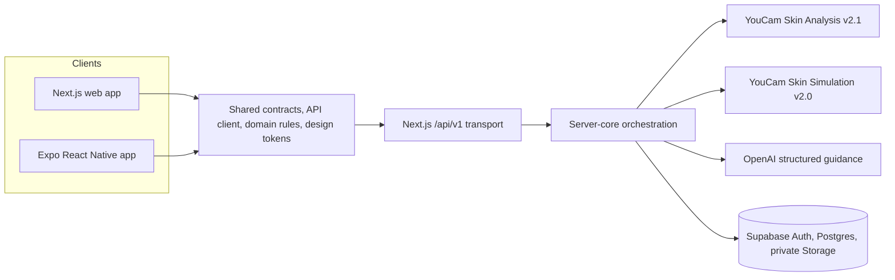

# SkinCause

[](LICENSE)

> **AI-powered acne insights, affordable guidance, and measurable progress.**

SkinCause is a privacy-first, acne-focused web and Android application that turns a single cosmetic skin scan into a controlled, trackable skincare experiment. Perfect Corp. YouCam APIs measure visible acne-related patterns and create an illustrative experiment goal; OpenAI organizes budget-aware product and nutrition guidance; repeated YouCam scans show what actually changes over time.

SkinCause provides cosmetic tracking and organizational insights, not medical diagnosis or treatment. A simulation is an illustration—not a forecast or guarantee of product results.


## Try SkinCause

- **Live web application:** [https://skin-cause-web.vercel.app](https://skin-cause-web.vercel.app)
- **Source repository:** [https://github.com/Husky-AI9/SkinCause](https://github.com/Husky-AI9/SkinCause)
- **Platforms:** responsive web and Expo/React Native Android
- **Guest access:** select **Start acne analysis**; no account is required for the disposable demo

### Judge walkthrough

1. Select **Start acne analysis** on the landing page.
2. Choose **Use acne demo image**, then select **Analyze image**.
3. Review the YouCam measurements and segmentation controls on the scan page.
4. Open **Acne plan** to see the baseline, visible acne pattern, routine, and quantified nutrition plan.
5. Open **Experiment**, enter a budget, and select **AI routine suggestion**.
6. Review the product action, real candidate product, price context, and food guidance applied to the experiment.
7. Select **Generate simulation** and drag the before/after slider to compare the original portrait with the YouCam illustration.
8. Use **Delete my data** from Acne plan to remove the disposable workspace.

The judge-facing journey uses the same synthetic acne-visible portrait for the scan, segmentation overlays, experiment evidence, and YouCam simulation. This makes the relationship between measurement, guidance, and illustration easy to verify.

## The problem

Acne-related concerns are common, emotionally difficult, and expensive to navigate. A user may change several products at once, purchase recommendations that exceed their budget, or react to a single selfie score without knowing whether lighting and capture conditions affected it. A nutrition suggestion can introduce another variable and make the result even harder to interpret.

SkinCause is designed for a consumer who wants an accessible starting point without treating an AI score as a diagnosis. It connects four moments in one coherent loop:

1. **Measure** visible acne-related cosmetic signals with YouCam Skin Analysis.
2. **Plan** one affordable product change with OpenAI-assisted guidance.
3. **Illustrate** the selected cosmetic goal with YouCam Skin Simulation.
4. **Verify** the real outcome through repeated, comparable YouCam scans.

## What SkinCause does

- Accepts a camera image, uploaded image, or prepared synthetic demo portrait.
- Uses **YouCam AI Skin Analysis v2.1** to measure visible blemish, redness, oiliness, pore, texture, and related cosmetic signals.
- Displays YouCam segmentation masks below the unchanged scan image so users can inspect where a signal was observed.
- Builds an Acne Plan containing the baseline measurements, visible acne-pattern assessment, routine, planned change, and nutrition quantities.
- Uses OpenAI to organize a budget-aware action: keep, suspend, replace, or add one skincare product.
- Surfaces a real candidate product with a product image, package size, unit-price context, availability note, source link, and price-check date when available.
- Keeps food guidance measurable while separating it from the active product experiment so only one variable changes at a time.
- Uses **YouCam AI Skin Simulation v2.0** on the same baseline portrait to generate an illustrative cosmetic goal.
- Provides an interactive before/after slider while clearly labeling the result as an illustration, not a guaranteed outcome.
- Supports a disposable guest demo and authenticated Supabase workspaces.
- Runs as both a responsive Next.js web app and an Expo/React Native Android app using the same versioned API contracts.
- Lets the user delete their images and workspace data from Acne Plan.

## How SkinCause uses YouCam

YouCam is the measurement and visualization engine at two distinct stages of the product lifecycle. It is not used as a decorative one-call result.

### 1. YouCam AI Skin Analysis v2.1: establish and repeat the measurement

The web and mobile clients send the selected image to SkinCause's versioned server API. Provider credentials never enter the browser or mobile bundle. The server then performs the complete YouCam asynchronous workflow:

```text
Client image
   │
   ▼
POST /api/v1/scans/upload-sessions
   │  validate MIME type, size, dimensions, ownership, and request ID
   ▼
POST /s2s/v2.1/file/skin-analysis
   │  receive provider file ID and signed upload request
   ▼
Upload image to the signed YouCam URL
   │
   ▼
POST /s2s/v2.1/task/skin-analysis
   │  request selected concerns + mask overlays
   ▼
GET /s2s/v2.1/task/skin-analysis/{task_id}
   │  poll queued/processing/success/error states
   ▼
Validate and normalize scores + expose safe segmentation masks
```

SkinCause requests the relevant YouCam concern actions, enables mask overlays, validates every provider response with Zod, converts provider score direction into a consistent visible-severity scale, and preserves the provider version and analysis-profile version with the result. Provider error codes are mapped to useful retry states instead of being exposed directly to users.

The normalized YouCam output becomes:

- the baseline on Acne Plan;
- the measurements locked into a one-change experiment;
- the evidence used for an affordable routine suggestion;
- the values compared during follow-up scans; and
- the source of segmentation controls shown beside the original image.

OpenAI receives normalized measurement data and structured routine context—not the scan image or provider authorization headers.

### 2. YouCam AI Skin Simulation v2.0: illustrate the experiment goal

After the user accepts or adjusts the planned product change, SkinCause uses the same baseline portrait and sends selected cosmetic parameters to YouCam Skin Simulation. Supported provider parameters include acne, oiliness, pores, redness, texture, spots, radiance, dark circles, eye bags, and wrinkles; the acne-focused interface prioritizes the measurements relevant to the experiment.

```text
Baseline portrait + selected cosmetic parameters
   │
   ▼
POST /s2s/v2.0/file/skin-simulation when an upload slot is needed
   │
   ▼
POST /s2s/v2.0/task/skin-simulation
   │  create an idempotent asynchronous simulation task
   ▼
GET /s2s/v2.0/task/skin-simulation/{task_id}
   │  poll until success or a normalized error
   ▼
Validate image → store/proxy privately → display in before/after slider
```

SkinCause validates that the returned result is an HTTPS image, verifies its type and size, copies authenticated results into private short-lived storage, and removes expired or user-deleted illustrations. Idempotency hashes prevent repeated taps or app resumes from creating duplicate paid YouCam tasks.

The UI always keeps the generated image beside the original portrait and states that it is a **YouCam-generated illustration—not a prediction or guarantee that a product will create the result**. Follow-up YouCam Skin Analysis scans, not the simulation, determine whether the measured pattern changes.

## Why this is more than an API wrapper

A one-call analyzer ends after returning a score. SkinCause builds a decision workflow around the YouCam output:

- **Two YouCam APIs, two lifecycle moments:** Skin Analysis measures the baseline and follow-ups; Skin Simulation communicates the selected goal.
- **Controlled experiments:** one product action is changed while the selected measurements remain locked for comparison.
- **Longitudinal evidence:** normalized YouCam results are stored with capture and profile metadata and compared over time.
- **Asynchronous task reliability:** file creation, signed upload, task creation, polling, resume, timeout, failure, and schema-drift states are implemented.
- **Paid-task protection:** idempotency keys and persisted task IDs avoid duplicate provider work.
- **Provider boundary:** mock and live providers implement the same server-only interface, supporting reliable demos and automated tests.
- **Explainable AI composition:** OpenAI organizes structured guidance from YouCam measurements, routine history, experiment state, budget, and availability context.
- **Honest visualization:** the simulated image is visually useful but explicitly separated from measured evidence.
- **Cross-platform reuse:** web and mobile share contracts, domain wording, API clients, and server workflows instead of duplicating vendor logic.

## Product architecture



### Trust boundaries

- **Clients:** capture/select images, render normalized DTOs, and hold only public configuration.
- **`/api/v1`:** authenticates the actor, validates contracts, issues upload sessions, and delegates to portable services.
- **Server core:** owns provider adapters, idempotency, polling, score normalization, experiment rules, and error mapping.
- **YouCam:** receives an image only for a user-requested analysis or simulation.
- **OpenAI:** receives normalized scores and structured product/experiment context; it does not receive the user's image.
- **Supabase:** provides anonymous or email authentication, Row Level Security, owner-scoped records, and private image buckets.

### Repository layout

| Path | Responsibility |
| --- | --- |
| `apps/web` | Next.js App Router UI and thin `/api/v1` route handlers |
| `apps/mobile` | Expo Router Android/iOS client using the same API and domain contracts |
| `packages/contracts` | Zod schemas, request/response DTOs, error envelopes, and status types |
| `packages/api-client` | Fetch-based client compatible with browsers and React Native |
| `packages/domain` | Product policy, seeded story, wording, nutrition data, and simulation parameter helpers |
| `packages/association-engine` | Deterministic one-change experiment evidence calculation |
| `packages/server-core` | Server-only YouCam/OpenAI provider boundaries and persistent workflows |
| `packages/design-tokens` | Platform-neutral colors, spacing, type, radius, and motion tokens |
| `packages/test-fixtures` | Deterministic provider and contract fixtures |
| `supabase/migrations` | Database schema, Row Level Security, private storage, and deletion functions |
| `docs/openapi.json` | Versioned public API contract |
| `tests` | Unit, integration, contract, boundary, and end-to-end coverage |

## Technology stack

| Layer | Technology |
| --- | --- |
| Web | Next.js 16, React 19, TypeScript |
| Mobile | Expo Router, React Native, TypeScript |
| API | Next.js Route Handlers under `/api/v1` |
| Skin AI | Perfect Corp. YouCam AI Skin Analysis v2.1 and Skin Simulation v2.0 |
| Guidance AI | OpenAI Responses API with structured JSON outputs and deterministic fallback |
| Data | Supabase Postgres, Authentication, private Storage, Row Level Security |
| Validation | Zod contracts at client, transport, provider, and persistence boundaries |
| Testing | Vitest and Playwright |
| Deployment | Vercel web/API; installable Android APK for device demos |

## Privacy, safety, and reliability

- YouCam, OpenAI, and Supabase service credentials are server-only.
- Images, signed image URLs, authorization headers, raw sensitive notes, and secrets are excluded from logs.
- Original images are deleted by default after normalized results are available unless retention is explicitly required for the selected experiment.
- Simulation images are private, short-lived, and removable by the user.
- Supabase Row Level Security scopes products, scans, experiments, recommendations, and simulations to their owner.
- External provider task IDs and idempotency hashes allow interrupted scans to resume without starting duplicate paid tasks.
- Demo portraits are synthetic and were prepared for this project; no real person is scored in the seeded journey.
- Product price and availability are labeled as time-sensitive and should be verified before purchase.
- Nutrition guidance avoids restrictive diets, supplements, and claims that a food caused a visible skin change.
- Severe or concerning user-reported changes stop the experiment flow and direct the user to a qualified healthcare professional.

## Run the web app locally

### Prerequisites

- Node.js 20 or newer
- pnpm 10.14.0 through Corepack

```bash
corepack enable
pnpm install --frozen-lockfile
```

Copy the example environment file, then start the workspace:

```bash
cp .env.example .env
pnpm dev
```

On Windows PowerShell, use `Copy-Item .env.example .env`. Open [http://localhost:3000](http://localhost:3000).

`YOUCAM_MOCK_MODE=true` gives contributors a deterministic, credential-free provider path. Set the live provider variables only in a private server environment when validating the real YouCam integration.

## Run the Android app

1. Install Android Studio, the Android SDK, and an Android emulator.
2. Copy `apps/mobile/.env.example` to `apps/mobile/.env`.
3. Set `EXPO_PUBLIC_API_BASE_URL` to the deployed API or to `http://10.0.2.2:3000/api/v1` for a server running on the Android emulator's host computer.
4. Set the public Supabase URL and publishable anonymous key.
5. Start the emulator and run:

```bash
pnpm mobile:android
```

The mobile app includes the landing page, disposable demo, account entry, Acne Plan, scan capture/gallery selection, segmentation controls, experiment studio, affordable product and nutrition guidance, YouCam simulation slider, product inventory, and data deletion.

## Environment variables

Never commit real values. Variables beginning with `NEXT_PUBLIC_` or `EXPO_PUBLIC_` are intentionally public client configuration; all provider and service-role secrets must remain server-only.

| Variable | Scope | Purpose |
| --- | --- | --- |
| `NEXT_PUBLIC_APP_URL` | Public web | Deployed application origin |
| `NEXT_PUBLIC_API_BASE_URL` | Public web | Versioned `/api/v1` base URL |
| `NEXT_PUBLIC_SUPABASE_URL` | Public web | Supabase project URL |
| `NEXT_PUBLIC_SUPABASE_ANON_KEY` | Public web | Supabase publishable/anonymous key |
| `NEXT_PUBLIC_SUPABASE_ANONYMOUS_ENABLED` | Public web | Enables the disposable hosted demo session |
| `SUPABASE_SERVICE_ROLE_KEY` | Server only | Persistence and private storage orchestration |
| `YOUCAM_API_KEY` | Server only | Bearer credential for both YouCam APIs |
| `YOUCAM_API_BASE_URL` | Server only | YouCam API origin; defaults to `https://yce-api-01.makeupar.com` |
| `YOUCAM_API_VERSION` | Server only | Skin Analysis version; defaults to `v2.1` |
| `YOUCAM_SIMULATION_API_URL` | Server only | Skin Simulation v2.0 task endpoint |
| `YOUCAM_MOCK_MODE` | Server only | Selects deterministic mock or live YouCam providers |
| `YOUCAM_POLL_TIMEOUT_MS` | Server only | Maximum foreground provider polling window |
| `YOUCAM_MAX_IMAGE_BYTES` | Server only | Scan upload size limit |
| `OPENAI_API_KEY` | Server only | Structured acne-pattern and routine guidance |
| `OPENAI_API_BASE_URL` | Server only | Optional OpenAI-compatible endpoint override |
| `OPENAI_RECOMMENDATION_MODEL` | Server only | Routine recommendation model |
| `OPENAI_ACNE_ASSESSMENT_MODEL` | Server only | Visible acne-pattern assessment model |
| `OPENAI_MOCK_MODE` | Server only | Selects deterministic or live guidance provider |
| `DEFAULT_RETAIN_ORIGINAL_IMAGES` | Server only | Original-image retention policy; defaults to `false` |
| `GUEST_WORKSPACE_TTL_HOURS` | Server only | Disposable demo lifetime |
| `EXPO_PUBLIC_API_BASE_URL` | Public mobile | Hosted or emulator-accessible API base URL |
| `EXPO_PUBLIC_SUPABASE_URL` | Public mobile | Supabase project URL |
| `EXPO_PUBLIC_SUPABASE_ANON_KEY` | Public mobile | Supabase publishable/anonymous key |

## Supabase setup

1. Create a Supabase project.
2. Apply every migration in `supabase/migrations` in filename order.
3. Enable **Anonymous Sign-Ins** for the disposable demo.
4. Configure the production site URL and allowed redirect URLs.
5. Keep the `scan-images` and `simulation-images` buckets private.
6. Add the public project URL/key to the web and mobile environments and the service-role key only to the server environment.

The migrations create owner-scoped products, routine periods, scans, scan concerns, experiments, check-ins, recommendations, simulations, private storage buckets, Row Level Security policies, and account-deletion support.

## Deploy the web app to Vercel

1. Import the repository into Vercel.
2. Set **Root Directory** to `apps/web`.
3. Keep **Include source files outside of the Root Directory** enabled so workspace packages are available.
4. Add the production environment variables listed above.
5. Set `YOUCAM_MOCK_MODE=false` and `OPENAI_MOCK_MODE=false` only for deployments intended to call the live paid providers.
6. Deploy using the checked-in `apps/web/vercel.json`, which performs a frozen-lockfile pnpm install and production build.
7. Run the judge walkthrough against the production URL and verify data deletion before submitting.

Use mock mode in untrusted preview deployments to avoid consuming API units. Never expose `YOUCAM_API_KEY`, `OPENAI_API_KEY`, or `SUPABASE_SERVICE_ROLE_KEY` as public variables.

## Quality checks

```bash
pnpm lint
pnpm typecheck
pnpm test
pnpm test:integration
pnpm openapi:check
pnpm test:contracts
pnpm mobile:typecheck
pnpm build
pnpm test:e2e
```

The test suite covers association calculations, API contracts, provider response normalization, image validation, upload and resume behavior, deletion, package boundaries, and the seeded browser journey. Mock providers keep automated tests deterministic and free of paid API calls.


## Project status and limitations

- SkinCause is a hackathon prototype, not a medical device.
- Visible acne-pattern wording is a cosmetic interpretation of normalized measurements, not a clinical diagnosis.
- Product price, stock, and retailer information can change after the recorded verification date.
- Nutrition information is general context and is not a prescription or proof that food caused a skin change.
- The YouCam simulation is an illustration of selected cosmetic parameters; only repeated analysis can provide follow-up measurement evidence.
- A production app-store release would require a production Android signing key, store review, and final legal/privacy review.

## Terms and attribution

Perfect Corp. and YouCam are trademarks of their respective owner. Use of the YouCam APIs is subject to the applicable Perfect Corp. and YouCam terms. OpenAI, Supabase, Expo, Next.js, React, and other third-party packages remain subject to their respective terms and licenses. Product names, retailer links, and time-sensitive price information are shown only to identify recommendation candidates and should be independently verified.

## License

Unless otherwise noted, SkinCause's original source code is available under the [Apache License 2.0](LICENSE). Third-party services, packages, trademarks, product imagery, and other third-party materials remain subject to their respective terms and licenses.
